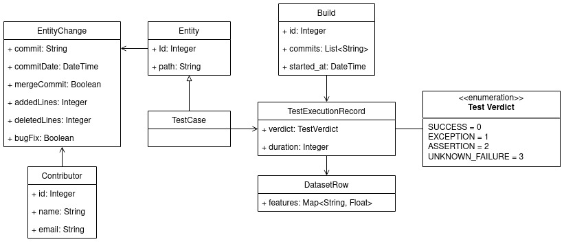

# Scalable and Accurate Test Case Prioritization in Continuous Integration Contexts

## Table of Contents
- [Introduction](#introduction)
- [The Dataset's Class Diagram](#the-datasets-class-diagram)
- [Environment Setup](#environment-setup)
  * [Python Environment](#python-environment)
  * [Understand](#understand)
  * [Java](#java)
- [Usage Instructions](#usage-instructions)
- [Outputs](#outputs)

## Introduction

This project aims to extract and compute test case features from different data sources related to a software repository. It analyzes the source code both statically and based on its version control history and creates dependency graphs containing the relationships between files/functions and their association weights. It also processes build logs and computes features based on test case execution records. Finally, since the goal of collecting these features is for solving the Test Case Prioritization (TCP) problem, it runs various experiments to measure the scalability and effectiveness of TCP.

In the following sections, we provide information on the requirements and instructions for running this project as well as descriptions regarding the data that this project generates. We also provide links to our **publication** and **public datasets** for reference and future work.

### Publication
This repository is a supplement to our academic paper which can be found on [10.1109/TSE.2022.3184842](https://ieeexplore.ieee.org/document/9801672). Please refer to the paper for details on definitions, experiments, and results. Please cite our paper in any published work that uses resources that are provided in this repository:
```
@article{yaraghi2021tcp,
    title={Scalable and Accurate Test Case Prioritization in Continuous Integration Contexts},
    author={Saboor Yaraghi, Ahmadreza and Bagherzadeh, Mojtaba and Kahani, Nafiseh and Briand, Lionel},
    journal={IEEE Transactions on Software Engineering},
    year={2022},
    doi={10.1109/TSE.2022.3184842}
}
```

### Dataset
In our work, we collected datasets for 25 carefully selected open-source projects using this repository. The datasets are publicly available here:
[](https://doi.org/10.5281/zenodo.6415365)


## The Dataset's Class Diagram

The above class diagram summarizes the structure of the dataset. For detailed information regarding the dataset files, please refer to the [Outputs](#outputs) section.

## Environment Setup
### Python Environment
This project is tested on Python 3.7+. The required Python dependencies can be installed via the following command:
```bash
pip install -r requirements.txt
```
### Understand
Understand is a code analysis enterprise software with a wide variety of [supported languages](https://support.scitools.com/support/solutions/articles/70000582794-supported-languages) which provides static dependencies available in a source code between files, functions, classes, etc. For more details on the feature of this software, visit [this link](https://scitools.com/features). In this project, we utilize Understand to create static dependency graphs to collect a part of our features. 

In this section, we will explain how to install and set up Understand to obtain a file with `.und` format which is the output of Understand's analysis. Note that this project needs Understand's database for extracting features and will not work without it.

#### Installing Understand's CLI
You can download the latest stable version of Understand from [this link](https://licensing.scitools.com/download). To run this project, you need to add the `und` command to your PATH environment variable so the `und` command is recognized in the shell. `und` is located in the `bin` directory of Understand's software.

```bash
export PATH="$PATH:/path/to/understand/scitools/bin/linux64"
```

Finally, run the following command to make sure `und` is successfully installed:

```bash
$ und version
(Build 1029)
```

#### Note
This project has been tested on *Build 1029* of Understand on Linux (specifically Ubuntu). It may require minor compatibility changes if it is used on other Understand builds or other operating systems.

#### Adding Understand Python Package/Library
Unlike typical projects, Understand does not provide its Python library in the well-known pip package installer, and you need to manually add the package to your Python environment. The instructions for adding the package are explained in [this link](https://support.scitools.com/support/solutions/articles/70000582852-getting-started-with-the-python-api).

### Java
This project uses [RankLib](https://sourceforge.net/p/lemur/wiki/RankLib) for training and testing machine learning ranking models. RankLib is a library of learning-to-rank algorithms, and it is written in Java. Hence, this project requires Java for running training and testing experiments. This project is trained and tested on OpenJDK version `1.8.0_292` and `11.0.11`.

## Usage Instructions
After setting up the environment, you are ready to start using the project.

This project consists of multiple sub-commands and each performs a different task. Each sub-command is explained in the following sections.

### The `tr_torrent` Sub-command

This sub-command processes *Maven* build logs that were downloaded by [*TravisTorrent*](https://github.com/TestRoots/travistorrent-tools) and creates the CI data required by the `dataset` sub-command. This sub-command requires the `repo-data-travis.json` and `data.csv` files and the build logs generated by TravisTorrent for each project. The arguments for this sub-command are shown in the following table.

Argument Name | Description
--- | ---
-r REPO, --repo REPO | The login and name of the repo separated by `@` (e.g., apache@commons).
-i INPUT_PATH, --input-path INPUT_PATH | Specifies the directory of *TravisTorrent* raw data (builds info and logs).
-o OUTPUT_PATH, --output-path OUTPUT_PATH | Specifies the directory to save resulting data.

An example of using the `tr_torrent` sub-command:
```
python main.py tr_torrent -i ../travistorrent-tools -o ../tr-torrent -r apache@commons
```

### The `dataset` Sub-command
This sub-command collects and creates a training dataset including all test case features for each failed CI build (cycle). It requires two main sources of data: source code and CI data. The source code can be either provided in form of a GitHub repository or a path to the source code. For CI data, a path should be provided which includes a repository folder containing two CSV files with a specific format (the file format will be discussed later). The arguments for this sub-command are shown in the following table.

Argument Name | Description
--- | ---
-p PROJECT_PATH, --project-path PROJECT_PATH | Project's source code Git repository path.
-s PROJECT_SLUG, --project-slug PROJECT_SLUG | The project's GitHub slug, e.g., apache/commons.
-c CI_DATA_PATH, --ci-data-path CI_DATA_PATH | Path to CI data root directory.
-o OUTPUT_PATH, --output-path OUTPUT_PATH | Specifies the directory to save resulting datasets.

An example of using the `dataset` sub-command:
```
python main.py dataset -s apache/commons -c ../rtp-torrent -o ./datasets/apache@commons
```

**Note:** At least one of the `--project-path` or `--project-slug` arguments should be provided since the project requires the source code for analysis.

#### The CI Data File Format
The CI data files for each project should be under a folder named with its repository name (login and name of the repo separated by `@`, e.g., `apache@commons`). The repository folder should contain two files with names `<repo-name>-full.csv` and `<repo-name>-builds.csv` (e.g., `apache@commons-full.csv`, `apache@commons-builds.csv`). The `<repo-name>-full.csv` file should contain test case execution records for all jobs across all builds, which includes the following columns:
- `travisBuildId`: Id of the Travis CI build.
- `travisJobId`: Id of the Travis CI job.
- `testName`: The class name of the test case including its package name (e.g., `com.example.Test`).
- `duration`: The duration of the test case execution in seconds.
- `count`: The number of test methods executed in the test class.
- `failures`: The number of failures that occurred in the execution of the test class.
- `errors`: The number of errors that occurred in the execution of the test class.
- `skipped`: The number of skipped test methods in the execution of the test class.

**Note:** The full test class name is required for matching it with its corresponding source file. Also, the last four columns are based on the data available in *Maven* logs. `failures` refer to test cases' failures due to wrong outputs or assertion errors, whereas `errors` refer to unexpected behaviors such as runtime exceptions.

The `<repo-name>-builds.csv` file should contain build information, which includes the following columns:
- `tr_build_id`: Id of the Travis CI build.
- `git_all_built_commits`: Full hashes of all Git commits that were built in the build, and the commit hashes are separated by the `#` character.
- `gh_build_started_at`: The starting date and time of the build (e.g., `2020-01-15 17:56:24 UTC`).
- `jobs`: A JSON list of all Travis CI job ids that were executed in the build (e.g., `"[620564834, 620564835]"`).

### The `learn` Sub-command
This sub-command performs learning (training and evaluation) experiments on collected features using RankLib. Since it requires test case features as input, the `dataset` sub-command should be successfully executed before executing this sub-command. The arguments for this sub-command are shown in the following table.

Argument Name | Description
--- | ---
-o OUTPUT_PATH, --output-path OUTPUT_PATH | Specifies the directory to load required data and save results.
-t TEST_COUNT, --test-count TEST_COUNT | Specifies the number of recent builds to test the trained models on.
-r {best,all}, --ranking-models {best,all} | Specifies the ranking model(s) to use for learning.
-e EXPERIMENT, --experiment EXPERIMENT | Specifies the experiment to run. Only works when the best ranking model is selected.

An example of using the `learn` sub-command:
```
python main.py learn -o ./datasets/apache@commons -t 50 -r best -e FULL
```

**Note:** The `all` option for the `--ranking-models` argument runs the learning experiments on six ranking algorithms including all test case features. Based on our study, the Random Forest (RF) model was the best algorithm, and therefore, when the option `best` is selected for `--ranking-models`, RF will be used. Finally, the `--experiment` can have the following values: {FULL, WO_IMP, WO_TES_COM, WO_TES_PRO, WO_TES_CHN, WO_REC, WO_COV, WO_COD_COV_COM, WO_COD_COV_PRO, WO_COD_COV_CHN, WO_DET_COV, W_Code, W_Execution, W_Coverage}. In the `FULL` experiment, all test case features will be included in the learning process. However, the options that begin with `WO_` will exclude the feature group in their name (e.g., `WO_TES_COM` will exclude `TES_COM`), and the options that begin with `W_` will only include the high-level feature group in their name. For detailed information regarding the experiments, please refer to our paper.

### The `decay_test` Sub-command
This sub-command performs TCP model decay experiments on trained models (for more details about this experiment, refer to the paper). Since it reuses the previously trained models, the `learn` sub-command should be successfully executed before executing this sub-command. The arguments for this sub-command are shown in the following table.

Argument Name | Description
--- | ---
-o OUTPUT_PATH, --output-path OUTPUT_PATH | Specifies the directory to load required data and save results.
-p PROJECT_PATH, --project-path PROJECT_PATH | Project's source code Git repository path.

An example of using the `decay_test` sub-command:
```
python main.py decay_test -o ./datasets/apache@commons -p ./datasets/apache@commons/commons
```


## Outputs

In this section, we will describe the output files that each sub-command creates.

### `dataset` Output Files

The `dataset` sub-command creates the following files as its outputs: 
- `dataset.csv`: Contains test case features across failed CI builds.
- `exe.csv`: Contains the execution history of the test cases that is used to create the dataset.
- `entity_change_history.csv`: Contains the change history of source code entities based on all Git commits.
- `id_map.csv`: Contains a map that relates a source code file relative path to a unique integer identifier.
- `builds.csv`: Contains information of CI builds.
- `contributors.csv`: Contains information of contributors the project.

#### Notes
- The `test_result` column in the `exe.csv` file can have the 4 following values: 0 for success/passed, 1 for failure due to exception, 2 for failure due to assertion, and 3 for failure due to an unknown reason.
- For some cases in the `id_map.csv` file, a number of paths have the same ID. The reason for assigning the same ID for these cases is that for creating the ID mapping, we tracked the change history of each file and if the file was renamed or moved to a different directory, we considered the new and old version of this file as a single source file with the same ID.
- There might be more test cases found in the source code of some repositories than the test cases available in `exe.csv`. We extracted the test case execution data from Travis CI build logs where not all test cases were necessarily executed.

#### The `analysis` Folder
In addition to the above CSV files, the `dataset` sub-command creates a directory named `analysis` which includes a number of sub-folders for each build which are named with build ids. Each sub-folder contains a `metadata.csv` file, and additionally, each sub-folder corresponding to failed builds contains a `tar.csv` and a `dep.csv` file. The `metadata.csv` file represents static features for each entity (file) captured by Understand for each build. Please visit [this link](https://support.scitools.com/support/solutions/articles/70000582223-what-metrics-does-understand-have-) for descriptions of all Understand metrics. The `dep.csv` file represents static and historical dependencies between the entities of the system under test (SUT). Static dependencies are extracted from Understand's database, and historical dependencies are represented by association weights for each static dependency which can be found in the `weights` column. 

The association weights are extracted by analyzing co-changes across Git commits and applying association rule mining to them using the Apriori algorithm. For each dependency, the association weight is either a single zero or four real numbers. A single zero means although Understand detected a static relation, there is no historical dependency between these two entities. In other words, among all analyzed commits, there is no commit in which both entities have changed. On the other hand, the four real numbers represent `support`, `forward_confidence`, `backward_confidence`, and `lift`. Note that assuming A has a dependency on B, `forward_confidence` is the confidence for A given B (A|B) and `backward_confidence` is the confidence for B given A (B|A). For precise definitions of the mentioned association metrics, please refer to the paper. Additionally, the `tar.csv` file represents the dependencies between test entities and entities of the SUT. This file is similar to `dep.csv`.

### `learn` Output Files
The `learn` sub-command creates a folder named `tsp_accuracy_results` which includes sub-folders for each learning experiment (e.g. `full` for learning using all features). Under each learning experiment sub-folder, there is a `results.csv` file, which contains TCP accuracies across builds, and there are a number of folders named with failed build ids that were used for evaluation, and each folder contains a trained model (`model.txt`), its feature stats (`feature_stats.csv`), an evaluation test suite (`test.txt`), and its prioritized prediction (`pred.txt`).
#### Notes
- All `.txt` files are in the format required by RankLib.
- The `W-` and `wo-` prefixes stand for with and without, respectively. The feature group after these prefixes indicates the features that the models were trained on.
- The `-outliers` suffix refers to the experiments in which outlier (frequent-failing) test cases were removed. For more details about outlier tests, please refer to the paper.
- For the `full-outliers` experiment, there is also two `heurisitc_<metric>_results.csv` (`<metric>` can be `apfd` or `apfdc`) files that include TCP evaluation results when using heuristics. For more details about our heuristic-based experiments, please refer to the paper.

### `decay` Output Files
The `decay` sub-command creates a folder named `decay_datasets` which includes sub-folders named with failed build ids that were used for evaluation, and each sub-folder contains a `dataset.csv` file (the dataset is used for evaluation of subsequent builds), a `test.txt` and a `pred.txt` file which include all test builds and prioritization predictions, respectively, and a `results.csv` file which includes accuracies of the predictions. For more details about the decay experiment, please refer to the paper.
